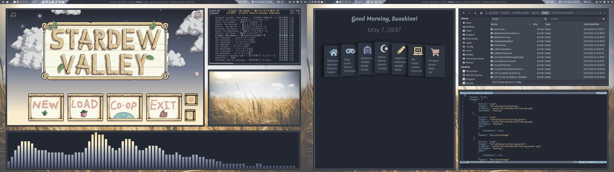

Wheatfield 
======

  
Themes
------

**Xfwm theme**  
[2bxfwm window manager theme Github](https://github.com/addy-dclxvi/xfwm4-theme-collections)    
with adjusted colors   
Moon is inactive grey, active blue    
Sun is inactive blue, active yellow   

**GTK Theme**  
Basically a mix of   
[Arc Black Steel GTK Theme Github](https://github.com/rtlewis88/rtl88-Themes/tree/Arc-Black-COLORS)  and    
[Arc Theme Github](https://github.com/jnsh/arc-theme)   
where someone who has no idea what they are doing (me) ripped out parts of both and put them together to create some kind of monster that one day will gain consciousness and murder me in my sleep. It's mainly the colors of arc darker with the silver highlights and buttons of arc black steel, but behind that the css looks so horrible that one glance is enough to cause permanent mental damage, which is why I won't be sharing this.  

Getting rid of GTK 3 CSD with    
[gtk-nocsd Github](https://github.com/ZaWertun/gtk3-nocsd)  

**Neovim Theme**  
Edited the nord theme with my own colors since I am too lazy to figure out how to make one from scratch  
[Nord-vim theme Github](https://github.com/arcticicestudio/nord-vim) 

Icons  
-----
  
[Jade Icon Theme Github](https://github.com/madmaxms/iconpack-jade)  
Used the Silver Dark variant   

Polybar  
-------

**Polywins script**  
[Github](https://github.com/alnj/polywins)  
  
**Weather plugin**  
[Github](https://github.com/polybar/polybar-scripts/tree/master/polybar-scripts/openweathermap-simple)  

More information is in the [polybar config readme](home/.config/polybar/readme.md).  

Fonts
-----
[Iosevka Nerd Font](https://github.com/ryanoasis/nerd-fonts) for polybar 
   
[Poppins](https://fonts.google.com/specimen/Poppins?category=Sans+Serif&sort=popularity&preview.size=12) for system (GTK) and polybar and Cantarell for system (Qt)   

My zsh config needs a terminal font with nerd font glyphs, I patched Consolas for myself, but I assume every nerd font will do. I'm not even using complete for Consolas, because I don't like the changed line height when adding powerline symbols.  
   
Consolas is also used in my polybar for the system monitor modules.   

   
Wallpapers  
-----------
 
**Currently used** 
[Wheat](https://pixabay.com/de/photos/landwirtschaft-weizenfeld-weizen-1845835/)  
  
**Similar style**  
[Golden Flowers](https://pixabay.com/de/photos/blumen-gras-natur-pflanzen-1840036/)  
[Green Branches](https://pixabay.com/de/photos/niederlassungen-bl%C3%A4tter-natur-baum-1839997/)  
[Frozen Branches](https://pixabay.com/de/photos/zweig-nahaufnahme-flora-blumen-1839114/)  
[Purple Blooms](https://pixabay.com/de/photos/bl%C3%BCte-flora-blumen-lavendel-natur-1838368/)  

Other stuff  
-----------
  
**Startpage**  
Shamelessly cobbled together from those two:  
[Github](https://github.com/deepjyoti30/startpage)  
[Github](https://github.com/grtcdr/startpages)   

Using [Custom New Tab Page](https://addons.mozilla.org/en-US/firefox/addon/custom-new-tab-page/?utm_source=addons.mozilla.org) for Firefox to display it. I chose this one beacuse it leaves the address bar empty when opening a new tab. 

**Mouse cursor**  
[Quintom Cursor Theme - Snow](https://gitlab.com/Burning_Cube/quintom-cursor-theme)
  
